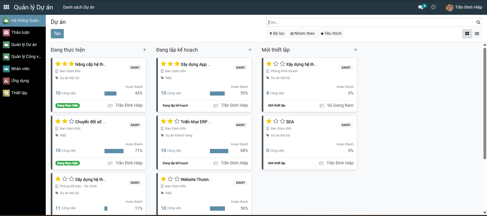
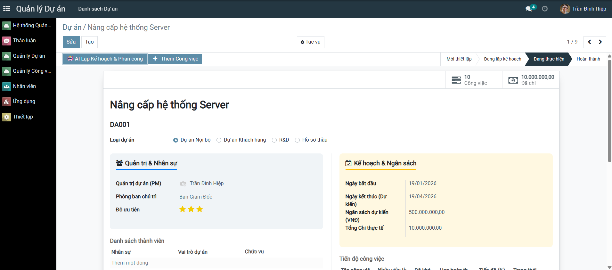
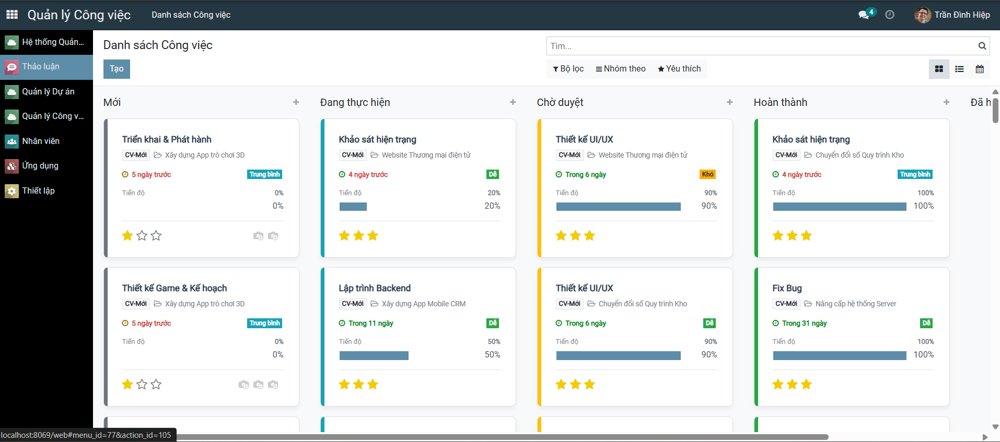
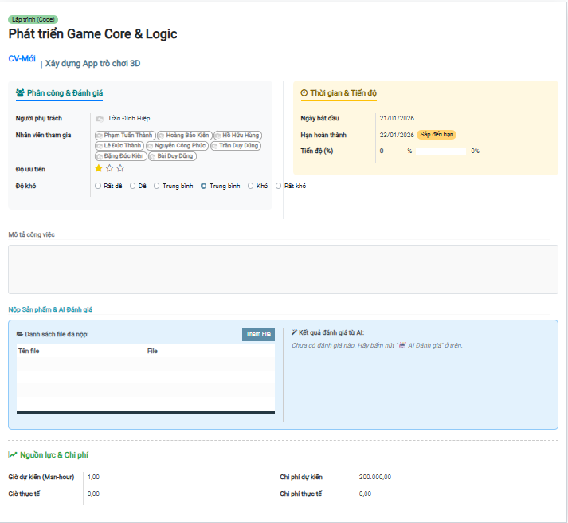

# 🚀 Hệ thống Quản lý Dự án và Quản lý Công việc


## 📖 Tổng quan

Dự án cung cấp bộ giải pháp toàn diện trên nền tảng Odoo, giúp doanh nghiệp chuẩn hóa quy trình từ **Quản lý Hồ sơ Nhân sự**, **Hoạch định Dự án** đến **Giám sát Tiến độ Công việc**.

Điểm đột phá của hệ thống là việc tích hợp **Google Gemini AI**, giúp tự động hóa quy trình đánh giá mã nguồn (Code Review) và kiểm tra chất lượng tài liệu, giúp Project Manager tiết kiệm 80% thời gian rà soát.

---

## 🌟 Tính năng Nổi bật

### 1. 🤖 Quản lý Công việc & AI Integration (`quan_ly_cong_viec`)
Đây là module cốt lõi với các tính năng công nghệ cao:
* **AI Code Review:** Tích hợp API **Google Gemini 2.5 Pro/Flash** để tự động đọc nội dung file code, chấm điểm, phát hiện lỗi logic/bảo mật và đưa ra nhận xét chi tiết dưới dạng HTML.
* **Smart Upload (1-Touch):** Widget upload cải tiến, cho phép chọn file trực tiếp từ máy tính (bỏ qua các bước popup trung gian), hỗ trợ kéo thả nhiều file.
* **Fast Upload Mode:** Hỗ trợ tải tài liệu lên ngay cả khi đang ở chế độ Xem (Read-only), không cần bấm nút "Sửa".
* **Visual Tracking:** Thanh tiến độ (Progress Bar) động, tự động đổi màu cảnh báo theo deadline (Xanh: Ổn, Vàng: Sắp hạn, Đỏ: Trễ hạn).

### 2. 🏗️ Quản lý Dự án Đầu tư (`quan_ly_du_an`)
* **Dashboard Quản trị:** Cái nhìn toàn cảnh về ngân sách dự kiến vs thực tế, tổng số giờ công (Man-hours).
* **Phân tích Đa chiều:** Tích hợp sẵn **Pivot View** và **Graph View** để báo cáo hiệu suất dự án theo thời gian thực.
* **Liên kết chặt chẽ:** Tự động đồng bộ dữ liệu giữa Dự án tổng và các Công việc con.

### 3. 👥 Quản lý Nhân sự (`quan_ly_nhan_su`)
* **Hồ sơ 360 độ:** Quản lý tập trung thông tin nhân viên, kỹ năng chuyên môn, và thông tin liên hệ.
* **Cấu trúc tổ chức:** Sơ đồ phòng ban, chức vụ và quản lý trực tiếp.

---

## 🛠️ Yêu cầu Kỹ thuật

Trước khi cài đặt, đảm bảo hệ thống đáp ứng các yêu cầu sau:

* **OS:** Ubuntu 20.04/22.04 hoặc Windows/MacOS.
* **Python:** 3.8 trở lên.
* **Odoo:** Phiên bản 14.0, 15.0 hoặc 16.0.
* **Database:** PostgreSQL 13+.

---

## ⚙️ Hướng dẫn Cài đặt & Triển khai

### Bước 1: Clone mã nguồn
```bash
git clone https://github.com/HiepTran04/TTDN_16-03_N8.git
cd odoo-fitdnu
```

### Bước 2: Cài đặt thư viện phụ thuộc
Cài đặt các thư viện Python cần thiết, đặc biệt là thư viện AI của Google:

```bash
pip install -r requirements.txt
pip install google-generativeai
```

### Bước 3: Cấu hình Odoo
Thêm đường dẫn module vào file odoo.conf:

```bash
[options]
addons_path = /path/to/odoo/addons,/path/to/your/custom_addons
admin_passwd = admin
db_host = localhost
db_port = 5432
db_user = odoo
db_password = odoo
```

### Bước 4: Cấu hình API Key
Để tính năng AI hoạt động, bạn cần cấu hình API Key:
Lấy API Key miễn phí tại Google AI Studio.
Mở file quan_ly_cong_viec/models/cong_viec.py.
Cập nhật biến API_KEY:

```bash
API_KEY = "API Key của bạn"
```

### Bước 5: Khởi chạy
```bash
./odoo-bin -c odoo.conf -u quan_ly_nhan_su,quan_ly_du_an,quan_ly_cong_viec
```

## 📸 Hình ảnh Minh họa
### 1. Giao diện Quản lý Nhân sự
<p align="center">
  
</p>
<p align="center">
  
</p>

### 2. Giao diện Quản lý Dự án
<p align="center">
  
</p>
<p align="center">
  
</p>

### 3. Giao diện Quản lý Công việc
<p align="center">
  
</p>
<p align="center">
  
</p>

### 4. Dashboard Phân tích Dự án

## 📂 Cấu trúc Thư mục
```bash
.
├── quan_ly_cong_viec/   # Logic xử lý AI, Task, Upload
├── quan_ly_du_an/       # Logic quản lý Dự án, Báo cáo
├── quan_ly_nhan_su/     # Logic quản lý Hồ sơ nhân viên
├── requirements.txt     # Danh sách thư viện Python
└── README.md            # Tài liệu này
```

### 🤝 Đóng góp
Mọi sự đóng góp đều được hoan nghênh. Vui lòng tạo Pull Request cho các tính năng mới hoặc mở Issue nếu phát hiện lỗi.

### 📄 Bản quyền
Dự án được phát triển bởi Trần Đình Hiệp.
